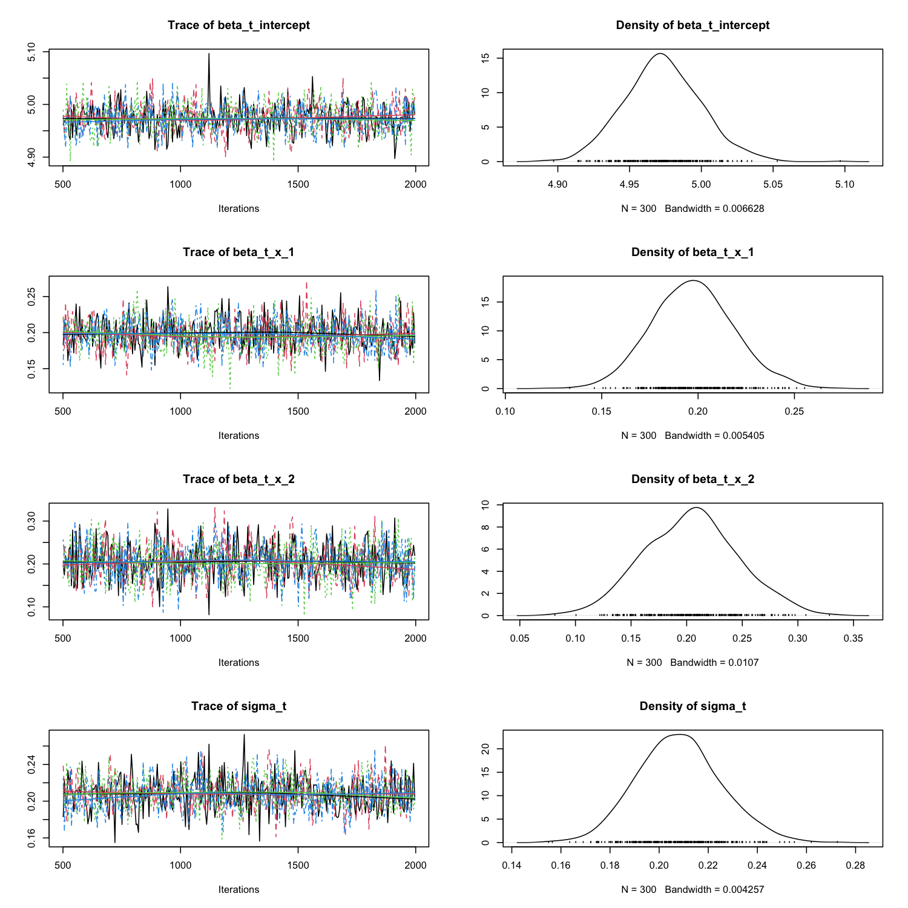
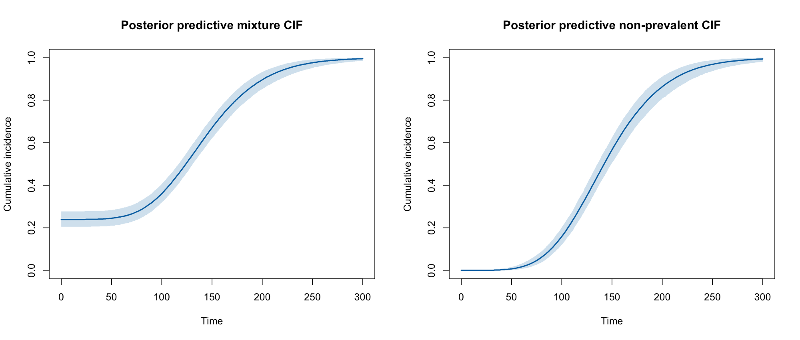
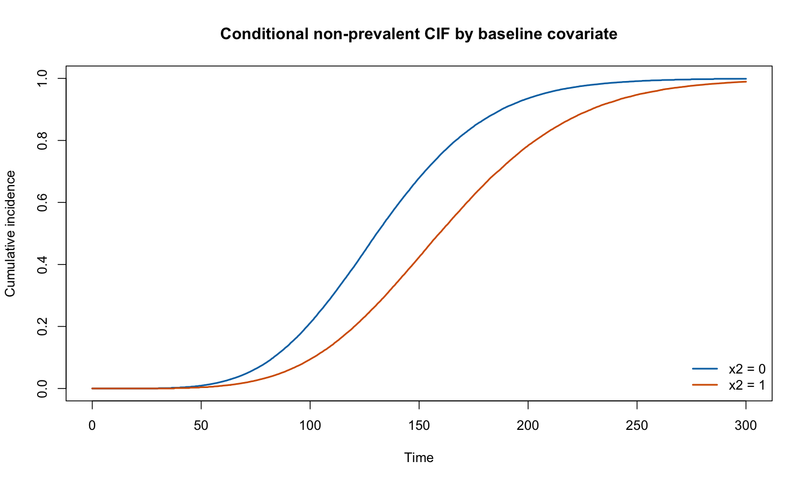

```{r, include = FALSE}
knitr::opts_chunk$set(
  collapse = TRUE,
  comment = "#>"
)
```

## Overview

In screening programs, individuals are periodically tested for a disease, such as cancer, before it becomes symptomatic. Two questions are usually of interest. First, what proportion of individuals already has the (pre-)disease at the start of follow-up, before any incident disease can develop? These cases are called *prevalent*. Second, at what rate do initially disease-free individuals develop the disease over time? This is the *incidence*. Because screening tests are imperfect, prevalent and incident cases are not directly observed: a truly positive individual may be missed at a screening round (imperfect sensitivity), and a positive baseline test cannot by itself distinguish a long-standing prevalent case from a very early incident one.

Prevalence-incidence models are often used to *disentangle* prevalence from incidence, that is, to estimate an incidence (cumulative distribution) function as if there were no prevalence at baseline. This describes disease progression in the initially healthy sub-population. In many applications, however, a *joint* representation is also useful, in which prevalence enters the cumulative incidence function as a point mass at time zero and incident events accumulate thereafter. `BayesPIM` estimates both representations from the same fitted model; they are compared in the posterior-estimation Section \@ref(sec-cifs).

`BayesPIM` implements the Bayesian prevalence-incidence mixture (PIM) model of Klausch et al. (2026). Time to incidence is modeled by an accelerated failure time (AFT) specification. With linear predictor $\eta_i = \mathbf{x}_{ti}'\boldsymbol{\beta}_t$, covariates multiply event times by $\exp(\eta_i)$ relative to a baseline distribution. For the Weibull, log-normal, and log-logistic families this is the familiar log-location-scale form

\begin{equation}
\log t_i = \eta_i + \sigma_t \epsilon_i,
(\#eq:aft)
\end{equation}

and gamma and Prentice generalized-gamma families are also available (Section \@ref(sec-information-criteria)). Baseline prevalence is modeled with a probit link. Writing $g_i = 1$ for a prevalent individual and $g_i = 0$ otherwise, and using a latent continuous variable $w_i$,

\begin{equation}
\Pr(g_i = 1 \mid \mathbf{x}_{gi}) = \Pr(w_i > 0 \mid \mathbf{x}_{gi}), \qquad
w_i = \mathbf{x}_{gi}'\boldsymbol{\beta}_g + \psi_i,
(\#eq:probit)
\end{equation}

where $\psi_i$ is a standard normal error. Finally, imperfect test sensitivity is captured by a parameter $\kappa$, the probability that a truly positive individual is detected at a screening round. $\kappa$ can be fixed at a known value or estimated (Section \@ref(sec-kappa)). The model is estimated with a Bayesian Gibbs sampler, using weakly informative default priors that regularize the likelihood when advanced-state events are infrequent, which is common in screening data.

An analysis with `BayesPIM` consists of the following steps, using dedicated functions:

1. Model estimation and convergence diagnosis (function `bayespim`)\
2. Information-criteria estimation for model comparison (function `get_ic`)\
3. Posterior summaries (functions `summary.bayespim`, `plot.bayespim`, `ppCIF`, and `plot.ppCIF`)\

These are discussed in Section \@ref(sec-model-estimation), Section \@ref(sec-information-criteria), and Section \@ref(sec-posterior-summaries). Additional options are discussed in Section \@ref(sec-further-topics).

## Model estimation using `bayespim` {#sec-model-estimation}

### Gibbs sampler {#sec-gibbs}

The function `bayespim` estimates the parameters of the model in equations \@ref(eq:aft) and \@ref(eq:probit) with a Gibbs sampler. The observed data for a non-prevalent individual is a series of negative screening tests followed either by a positive test or by right censoring. The exact event time is therefore never observed; it is only known to lie in one of the screening intervals. Moreover, because a test can miss a truly positive individual with probability $1-\kappa$, even the interval containing the event is uncertain. Bayesian data augmentation handles this missing information by imputing plausible latent quantities and then updating the model parameters given these quantities.

Klausch et al. (2026) originally augmented the *exact* latent event time $t_i$ for each individual and updated the incidence parameters with a Metropolis-Hastings step on the resulting complete-data likelihood. The current version of `BayesPIM` instead uses a *collapsed slice sampler*, which is the default (`sampler = "slice_collapsed"`). Rather than imputing an exact time, the collapsed sampler augments only the latent screening *interval* $(v_{i,k-1}, v_{ik}]$ in which the (possibly missed) event occurred, and updates the incidence parameters from the interval-censored likelihood, marginalizing over the exact position of $t_i$ within the interval. Marginalizing over $t_i$ in this way is known as *collapsing* (Liu, 1994). A collapsed Gibbs sampler preserves the target posterior but reduces the autocorrelation that exact-time augmentation induces, which yields faster convergence. This is why the collapsed sampler replaced the original Metropolis-Hastings sampler as the default; the earlier samplers remain available (Section \@ref(sec-samplers)).

The main steps of the Gibbs sampler are, after initialization:

1. Augment the latent prevalence indicators $g_i$ for individuals whose baseline status is unknown, collapsing over the latent time.\
2. Augment the latent screening interval containing the event for each non-prevalent individual, collapsing over the exact time within the interval.\
3. Draw the incidence parameters $(\boldsymbol{\beta}_t, \sigma_t)$ from the interval-censored complete-data posterior by univariate slice sampling.\
4. Draw the prevalence parameters $\boldsymbol{\beta}_g$ using the latent-normal representation of the probit model.\
5. If test sensitivity is estimated, update $\kappa$.\

These steps are run repeatedly. After a warm-up period, the sampler yields auto-correlated draws from the target posterior distribution of the parameters. Conditional on the augmented intervals and prevalence indicators, the incidence parameters are drawn from the complete-data posterior

\begin{align}
q(\boldsymbol{\beta}_t, \sigma_t \mid \cdot) \propto
L(\boldsymbol{\beta}_t, \sigma_t \mid \cdot)\,\pi(\boldsymbol{\beta}_t, \sigma_t),
\end{align}

where $L$ is the interval-censored complete-data likelihood and $\pi$ the prior density (Section \@ref(sec-prior-assumptions)). For an individual whose event has been augmented into interval $(v_{k-1}, v_k]$, the likelihood contribution is the probability that the event falls in that interval, $F_t(v_k) - F_t(v_{k-1})$, where $F_t$ is the cumulative distribution function of the incidence distribution. The full derivation is given in Klausch et al. (2026).

### `bayespim` input data structure {#sec-input-data}

`bayespim` accepts four data inputs: `v_obs`, `x_t`, `x_g`, and `r`. These have to be available for all individuals in the data; missing information has to be handled outside of `BayesPIM`.

Argument `v_obs` provides the observed screening times as a `list` of length $n$, one numeric vector per individual. Every vector starts with `0`, the baseline time. The remaining entries encode the screening series and its outcome:

- If the baseline test is positive, the vector is `c(0)`.
- If the baseline test is negative and right censoring occurs before the first regular screening, the vector is `c(0, Inf)`.
- Otherwise the vector ends with `Inf` for right censoring (e.g. `c(0, 22, 48, 77, Inf)`) or ends at the time of the positive test if an event is detected (e.g. `c(0, 23, 52, 78, 105, 132)`).

Because a longer screening series carries no extra information under the model's assumptions, only the times up to the event or to the last follow-up need to be supplied. Argument `r` is a binary vector of length $n$ indicating whether the baseline test was actually carried out (`r[i] = 1`) or is missing (`r[i] = 0`). Together, `v_obs` and `r` encode which cases are known prevalent (i.e. positive test at baseline), incident, or right censored, and whether their baseline status is known.

Arguments `x_t` and `x_g` take the covariates for the incidence and prevalence models, respectively, each an $n \times p$ `matrix`. The two sets of covariates may differ, although in practice the same covariates are often used for both. If no covariates are supplied, `x_t = NULL` and/or `x_g = NULL` give intercept-only models. Categorical variables have to be dummy-coded by the user; `stats::model.matrix` is useful for this.

By default, `standardize_covariates = TRUE` centers each non-binary covariate at its sample mean and divides it by its sample standard deviation before fitting. A column with exactly two observed values is detected as binary/dummy and is left unchanged. This standardization generally improves sampling when continuous covariates have very different scales. The returned chains and summaries are transformed back to the original covariate scale, and the original matrices remain in `$x_t` and `$x_g`. Set `standardize_covariates = FALSE` to fit directly on the supplied scale. Numerically coded categorical variables with more than two levels must still be dummy-coded; otherwise they are treated as continuous.

`BayesPIM` has a built-in data-generating function `gen_data` that simulates data under the model of Klausch et al. (2026); see `?gen_data` for all options. We use it to illustrate the input structure and model estimation.

```{r, eval = FALSE}
library(BayesPIM)

# Generate data under the PIM of Klausch et al. (2026)
set.seed(2025)
dat <- gen_data(
  kappa   = 0.7,          # Test sensitivity
  n       = 1e3,          # Sample size
  theta   = 0.2,          # Baseline prevalence when all covariates are zero
  p       = 1,            # Number of continuous covariates
  p_discrete = 1,         # Add one Bernoulli(0.5) covariate
  beta_t  = c(0.2, 0.2),  # True incidence slopes
  beta_g  = c(0.2, 0.2),  # True prevalence slopes
  mu_t    = 5,            # True incidence intercept
  sigma_t = 0.2,          # True incidence AFT scale
  dist    = "weibull",    # Incidence distribution
  v_min   = 20,           # Minimum time between screening moments
  v_max   = 30,           # Maximum time between screening moments
  mean_rc = 80,           # Mean time to right censoring (exponential)
  prob_r  = 1             # Probability that a baseline test is done
)
```

`gen_data` simulates the incidence times from the AFT model in equation \@ref(eq:aft), with intercept `mu_t` and slopes `beta_t`, and generates prevalence from the probit model in equation \@ref(eq:probit), with intercept `qnorm(theta)` (so `theta` is the prevalence probability when all covariates are zero) and slopes `beta_g`. A screening series is then superimposed: successive screening times are drawn uniformly between `v_min` and `v_max` apart, and the right-censoring time is exponential with mean `mean_rc`. At each screening time after the true event, a test detects the event with probability `kappa`. Besides `weibull`, the distributions `lognormal`, `loglog` (log-logistic), `gamma`, and `gengamma` (Prentice generalized gamma) are available.

The screening times are returned in `dat$v_obs`, in exactly the format `bayespim` expects. Looking at the first individuals illustrates the coding.

```{r, eval = FALSE}
head(dat$v_obs)
```
```text
[[1]]
[1] 0

[[2]]
[1]   0.00000  22.53705  51.89452  78.35944 104.52213 131.74624

[[3]]
[1]  0.00000 25.37066

[[4]]
[1] 0

[[5]]
[1]   0.00000  27.37410  53.60168  80.54386 108.43628       Inf

[[6]]
[1]  0.00000 22.31108 48.06398 77.10746      Inf
```

Individuals 1 and 4 have `c(0)` and are known prevalent (due to a positive baseline test). Individual 2 has an event detected at time `131.7`, and individual 3 at time `25.4`. Individuals 5 and 6 end in `Inf` and are right-censored without a detected event. In addition, `gen_data` returns the covariate matrix `dat$x`, the baseline-test indicator `dat$r`, and the latent quantities `dat$times_true` (true event times), `dat$g` (true prevalence status), and `dat$prob_g` (true prevalence probabilities), which are unobserved in practice and are not passed to `bayespim`.

Before running the sampler, it is useful to inspect the case mix.

```{r, eval = FALSE}
v <- dat$v_obs
prevalent <- vapply(v, function(x) length(x) == 1L, logical(1))
censored  <- vapply(v, function(x) length(x) > 1L && is.infinite(x[length(x)]), logical(1))
c(prevalent = sum(prevalent),
  incident  = sum(!prevalent & !censored),
  censored  = sum(censored))
```
```text
prevalent  incident  censored
      181       209       610
```

About 18% of individuals are prevalent and 21% have a detected incident event, which is ample for `bayespim` to run successfully. Care in model specification (number of covariates and choice of distribution) should be taken when advanced-state events are infrequent. `BayesPIM` is designed to cope with sparse events and usually converges if run long enough, but the precision of estimation may then be low, especially with many covariates.

### Prior assumptions {#sec-prior-assumptions}

Klausch et al. (2026) showed that weakly informative priors help to obtain stable estimates even when events are infrequent and the likelihood is nearly flat. `bayespim` uses such priors by default. For the incidence regression coefficients $\boldsymbol{\beta}_t$, a normal prior (`beta_prior = 'norm'`) is used by default, with standard deviation `tau_t` (default `1`); a Student-$t$ prior is available with `beta_prior = 't'`, in which case `tau_t` sets the degrees of freedom. A half-normal prior with standard deviation `sig_prior` (default `1`) is placed on the positive scale/dispersion parameter $\sigma_t$. For the prevalence coefficients $\boldsymbol{\beta}_g$, a zero-centered normal prior with standard deviation `tau_g` (default `1`) is used. In the generalized-gamma model, a zero-centered normal prior with standard deviation `q_prior_sd` is placed on the signed shape parameter $Q$. With the default covariate standardization, `tau_t` and `tau_g` apply to effects per one-standard-deviation change in a continuous covariate, while binary effects remain contrasts between their two supplied values. The internal intercept concerns an individual at the mean continuous-covariate values; returned intercepts are transformed back to covariate value zero.

The posterior can be sensitive to these choices when data are sparse, so a prior sensitivity analysis can be useful; see Klausch et al. (2026) for an example. Users can also supply a custom log-prior through `log_prior_fun`; see Section \@ref(sec-user-defined-prior) and `?log_aft_prior`.

### Basic `bayespim` run {#sec-basic-run}

We now fit a Weibull model to the simulated data. The incidence covariates are passed to `x_t`, the prevalence covariates to `x_g`, and the baseline-test indicator to `r`. Here the test sensitivity is known, so we set `kappa = 0.7` and `update_kappa = FALSE`; estimating $\kappa$ is discussed in Section \@ref(sec-kappa). The sampler runs `chains = 4` MCMC chains in parallel, which is needed for reliable convergence diagnostics and to generate draws efficiently. The user's machine should have at least `chains` free CPUs available.

```{r, eval = FALSE}
mod_slice <- bayespim(
  v_obs = dat$v_obs,
  x_t = dat$x,
  x_g = dat$x,
  r = dat$r,
  kappa = 0.7,
  update_kappa = FALSE,
  ndraws = 1e3,
  warmup = 5e2,
  save_every = 1,
  standardize_covariates = TRUE,
  chains = 4,
  seed_chains = 1:4,
  min_effss = 800,
  update_till_converge = FALSE,
  sampler = "slice_collapsed",
  dist = "weibull"
)
```

The desired incidence distribution is passed via `dist`. The basic behavior of the Gibbs sampler is controlled by `ndraws`, `warmup`, `chains`, `save_every`, and `seed_chains`. The call above runs `ndraws = 1000` iterations per chain and then stops (`update_till_converge = FALSE`). Each chain is randomly initialized, but the initialization and sampling are reproducible through `seed_chains`: one integer seed per chain, here `seed_chains = 1:4` for `chains = 4`. Repeating the run with the same seeds reproduces the posterior chains exactly; `seed_chains = NULL` initializes the chains randomly.

A good `warmup` value is not known a priori, so it is advisable to run the sampler for a moderate number of iterations first and inspect the trace plots (Section \@ref(sec-parameter-summaries)) to choose it. 

By default, `save_every = 1` stores every generated parameter draw in the returned `$par` chains. Convergence diagnostics and `summary` discard the first `warmup` generated iterations and then use every stored post-warm-up draw. `warmup` is always specified on the generated-iteration scale, independently of `save_every`: for example, `warmup = 500` and `save_every = 10` omit the 50 stored draws at iterations 10 through 500 in each chain, and the first retained draw is iteration 510. For values larger than one only every `save_every`-th draw is retained in memory and returned as `$par`; for example `save_every = 10` saves every 10th posterior draw in each chain in memory. Such 'thinning' reduces memory and chain auto-correlation but decreases precision of estimation of posterior statistics and convergence diagnostics. If storing all draws would exceed available memory, especially when `update_till_converge = TRUE` may append several large updates, set `save_every` to a value greater than one. Storage selection does not alter the Markov-chain trajectory, but the intervening parameter draws are permanently discarded and diagnostics and summaries can then use only the stored draws. The setting is inherited by manual and automatic updates. Because retaining all draws generally gives the most informative diagnostics and posterior estimates, values above one are recommended only when memory is a practical constraint. Plotting has a separate `thinning` argument that can reduce rendering cost without discarding draws from the fitted object.

After the requested draws, `bayespim` evaluates and prints convergence diagnostics: the rank-normalized split R-hat of Vehtari et al. (2021) and the effective sample size (ESS), computed with the `posterior` package (Bürkner et al., 2026). These are checked against `max_rhat` (default `1.01`) and `min_effss` (default `chains * 100`). To make the update workflow visible in this example, we use the stricter requirement `min_effss = 800` rather than the four-chain default of `400`.

```text
Convergence diagnostics after 1000 iterations per chain (500 stored post-warm-up draws used).
Convergence criteria: R-hat <= 1.010 and ESS >= 800.0
 block        parameter R_hat   ESS
     t beta_t_intercept 1.005 446.5
     t       beta_t_x_1 1.002 778.8
     t       beta_t_x_2 1.005 576.8
     t          sigma_t 1.010 554.4
     g beta_g_intercept 1.004 549.7
     g       beta_g_x_1 1.006 678.0
     g       beta_g_x_2 1.005 631.1
```

The table reports diagnostics for the incidence (`t`) and prevalence (`g`) parameter blocks. After 1000 draws all R-hat values meet their threshold, but several effective sample sizes are below the deliberately strict requirement of `800`. We therefore need more draws under this example's convergence rule, which can be added by updating the run (Section \@ref(sec-updating-runs)) or by letting `bayespim` update automatically (Section \@ref(sec-auto-convergence)). The runtime of the sampler is stored in the fitted object.

```{r, eval = FALSE}
mod_slice$runtime
```
```text
Time difference of 4.020705 secs
```

### Updating previous `bayespim` runs {#sec-updating-runs}

If an initial run has not converged, it can be continued by passing the fitted object to the `prev_run` argument of a new `bayespim` call. The chains resume from their last draws and the new draws are merged with the previous run. The number of added draws is controlled by `ndraws_update` (default: the original `ndraws`).

```{r, eval = FALSE}
mod_slice_update <- bayespim(
  prev_run = mod_slice,
  ndraws_update = 2e3,
  min_effss = 800
)
```
```text
Updating previous MCMC run.

Convergence diagnostics after 3000 iterations per chain (2500 stored post-warm-up draws used).
Convergence criteria: R-hat <= 1.010 and ESS >= 800.0
 block        parameter R_hat    ESS
     t beta_t_intercept 1.001 2186.3
     t       beta_t_x_1 1.002 4351.5
     t       beta_t_x_2 1.001 2685.5
     t          sigma_t 1.001 2672.2
     g beta_g_intercept 1.001 2951.2
     g       beta_g_x_1 1.001 3355.5
     g       beta_g_x_2 1.001 3287.6
```

After a further 2000 iterations per chain (3000 in total), all R-hat values are at most `1.002` and all effective sample sizes exceed `2100`, so the sampler has converged and we have ample draws for posterior inference. Data, sampler, priors, covariate-scaling constants, storage interval, and the end-of-chain random-number state are inherited from `prev_run`; we only repeat the stricter ESS criterion because convergence thresholds are call-specific. By default the original warm-up is retained; `warmup_updated = TRUE` instead increases the warm-up with each update.

### Automatic updating till convergence {#sec-auto-convergence}

Instead of adding draws manually, `bayespim` can update automatically until convergence with `update_till_converge = TRUE`. If the initial `ndraws` draws are not sufficient, another `ndraws_update` draws are added and convergence is re-evaluated, and so on, until the criteria (`max_rhat`, `min_effss`) are met or the maximum number of draws `maxit` (default `Inf`) is reached. This can be requested directly, without a manual initial run.

```{r, eval = FALSE}
mod_weibull <- bayespim(
  v_obs = dat$v_obs,
  x_t = dat$x,
  x_g = dat$x,
  r = dat$r,
  kappa = 0.7,
  update_kappa = FALSE,
  ndraws = 1e3,
  warmup = 5e2,
  save_every = 1,
  standardize_covariates = TRUE,
  chains = 4,
  seed_chains = 1:4,
  min_effss = 800,
  update_till_converge = TRUE,
  ndraws_update = 1e3,
  sampler = "slice_collapsed",
  dist = "weibull"
)
```
```text
Not converged after 1000 iterations per chain; updating with 1000 iterations.
Convergence criteria: R-hat <= 1.010 and ESS >= 800.0
 block        parameter R_hat   ESS
     t beta_t_intercept 1.005 446.5
     t       beta_t_x_1 1.002 778.8
     t       beta_t_x_2 1.005 576.8
     t          sigma_t 1.010 554.4
     g beta_g_intercept 1.004 549.7
     g       beta_g_x_1 1.006 678.0
     g       beta_g_x_2 1.005 631.1
Updating previous MCMC run.

Converged after 2000 iterations per chain (1500 stored post-warm-up draws used).
Convergence criteria: R-hat <= 1.010 and ESS >= 800.0
 block        parameter R_hat    ESS
     t beta_t_intercept 1.001 1275.2
     t       beta_t_x_1 1.002 2508.5
     t       beta_t_x_2 1.002 1651.9
     t          sigma_t 1.001 1660.3
     g beta_g_intercept 1.002 1769.4
     g       beta_g_x_1 1.001 2044.3
     g       beta_g_x_2 1.002 1904.0
```

Here a single automatic update of 1000 iterations was enough to reach convergence at 2000 iterations per chain. The whole fit, including the automatic update, took about seven seconds. This example uses `save_every = 1`, so all 2000 draws per chain are retained. For a substantially longer automatic run where the growing `$par` object might exceed available R memory, rerun the model with, for example, `save_every = 5`; the fit will store every fifth generated state, and convergence checks and summaries will use all of those stored states without further thinning.

```{r, eval = FALSE}
mod_weibull$runtime
```
```text
Time difference of 7.404977 secs
```

We use `mod_weibull` as the fitted Weibull model in the remainder of this guide. If `silent = TRUE` is passed, the progress output shown above is suppressed; the diagnostics are still computed and stored in the `convergence` element of the returned object.

## Obtaining information criteria after running `bayespim` {#sec-information-criteria}

In practice, the correct incidence distribution is unknown, so several models can be fitted and compared with information criteria. The function `get_ic` computes the deviance information criterion (DIC; Spiegelhalter et al., 2002) and two versions of the widely applicable information criterion (WAIC-1 and WAIC-2; Watanabe, 2010), as defined in Gelman et al. (2014). Lower values indicate better fit. The DIC is most appropriate when the posterior is approximately normal; the WAIC criteria are useful alternatives when some posteriors are skewed, which can occur for `BayesPIM`.

Besides the two-parameter families (`weibull`, `loglog`, `lognormal`, `gamma`), two informative comparisons are the constrained *exponential* model and the more flexible *generalized-gamma* model. The exponential model is the special case of the Weibull with the AFT scale $\sigma_t$ fixed at one, obtained with `dist = "weibull"`, `fix_sigma = TRUE`, and `sig_prior = 1`. Fixing $\sigma_t$ removes a parameter and stabilizes estimation in sparse data, but assumes a constant hazard over time (a Markov-type assumption). Conversely, the Prentice generalized gamma (`dist = "gengamma"`) has the Weibull, log-normal, and gamma as special cases through its extra signed shape parameter $Q$, and so is *less* constrained than the Weibull. It is available only with the collapsed slice sampler, for which convergence with the other samplers is typically slow.

We fit both alternatives to the same data, again updating till convergence.

```{r, eval = FALSE}
# Exponential model (Weibull with sigma fixed at 1)
mod_exp <- bayespim(
  v_obs = dat$v_obs, x_t = dat$x, x_g = dat$x, r = dat$r,
  kappa = 0.7, update_kappa = FALSE,
  ndraws = 1e3, warmup = 5e2, chains = 4, seed_chains = 5:8,
  update_till_converge = TRUE, ndraws_update = 1e3,
  sampler = "slice_collapsed", dist = "weibull",
  fix_sigma = TRUE, sig_prior = 1
)
```
```text
Converged after 2000 iterations per chain (1500 stored post-warm-up draws used).
Convergence criteria: R-hat <= 1.010 and ESS >= 400.0 for sampled parameters; fixed parameters excluded: t:sigma_t
 block        parameter R_hat    ESS
     t beta_t_intercept 1.002 2023.4
     t       beta_t_x_1 1.001 3515.5
     t       beta_t_x_2 1.001 2171.6
     g beta_g_intercept 1.003 1423.3
     g       beta_g_x_1 1.001 1533.1
     g       beta_g_x_2 1.002 1632.7
```
```{r, eval = FALSE}
# Generalized-gamma model (Weibull is a special case)
mod_gg <- bayespim(
  v_obs = dat$v_obs, x_t = dat$x, x_g = dat$x, r = dat$r,
  kappa = 0.7, update_kappa = FALSE,
  ndraws = 2e3, warmup = 1e3, chains = 4, seed_chains = 9:12,
  update_till_converge = TRUE, ndraws_update = 2e3,
  sampler = "slice_collapsed", dist = "gengamma"
)
```
```text
Converged after 4000 iterations per chain (3000 stored post-warm-up draws used).
Convergence criteria: R-hat <= 1.010 and ESS >= 400.0
 block        parameter R_hat    ESS
     t beta_t_intercept 1.002  865.4
     t       beta_t_x_1 1.001 4862.2
     t       beta_t_x_2 1.001 3053.9
     t          sigma_t 1.004 1331.2
     t              q_t 1.002  771.8
     g beta_g_intercept 1.001 3702.2
     g       beta_g_x_1 1.001 4023.0
     g       beta_g_x_2 1.001 4139.8
```

The exponential model reaches convergence quickly because fixing $\sigma_t$ imposes a strong constraint; the fixed parameter is reported as excluded from the diagnostics. The generalized-gamma model has an additional shape parameter `q_t` and needs more draws to converge. We now compare the three models.

```{r, eval = FALSE}
set.seed(2025)
get_ic(mod_weibull, samples = 1e3)
```
```text
        WAIC1    WAIC2      DIC
[1,] 2083.523 2083.659 2083.306
```
```{r, eval = FALSE}
set.seed(2025)
get_ic(mod_exp, samples = 1e3)
```
```text
       WAIC1    WAIC2      DIC
[1,] 2393.460 2393.552 2394.678
```
```{r, eval = FALSE}
set.seed(2025)
get_ic(mod_gg, samples = 1e3)
```
```text
        WAIC1    WAIC2      DIC
[1,] 2079.189 2079.437 2079.372
```

The exponential model has by far the highest (worst) information criteria, confirming that fixing $\sigma_t$ at one is inappropriate here: the data were generated with $\sigma_t = 0.2$, far from one. The Weibull and generalized-gamma models have very similar criteria, with only a small edge for the generalized gamma. Because the extra flexibility of the generalized gamma barely improves the fit, the more parsimonious Weibull is an adequate choice, which is plausible given that the data were generated from a Weibull model.

By default, `get_ic` uses every stored posterior draw available after warm-up; it applies no additional thinning. The explicit `samples` argument can request a random computational subsample. Estimation is computationally expensive and scales with the number of draws, so it is parallelized: `cores` sets the number of CPUs, and `cores = NULL` uses all available cores.

## Posterior summaries after running `bayespim` {#sec-posterior-summaries}

After estimating a model, interest usually lies in posterior inference on the parameters and in cumulative incidence functions as a function of time. `BayesPIM` provides built-in functionality for both: parameter summaries (Section \@ref(sec-parameter-summaries)) and posterior predictive CIFs (Section \@ref(sec-cifs)).

### Posterior summaries of the model parameters {#sec-parameter-summaries}

The posterior parameter draws are stored in the fitted object as a `coda::mcmc.list` named `$par` (Plummer et al., 2006). With the default `save_every = 1`, it contains every generated draw, including warm-up. With `save_every > 1`, it contains only the selected storage iterations. The plotting method discards stored draws belonging to the warm-up and may apply additional plot-only thinning for rendering speed; it does not modify the fitted object.

```{r, eval = FALSE}
plot(mod_weibull, thinning = 5)
```

It can be helpful to thin the chains for faster plotting and to discard some additional warm-up. Here we show the trace and density plots for the incidence (latent-time) parameters after a thinning interval of five; the four chains are overlaid.

```{r mcmc-traceplot, echo = FALSE, out.width = "100%", fig.cap = "Trace and density plots for the incidence (latent-time) model parameters of the Weibull fit."}

```

The chains mix well and are indistinguishable across the four colors, consistent with the R-hat and ESS diagnostics. Posterior summaries are obtained efficiently through the `summary` method, which reports posterior medians, 95% credible intervals, and the convergence diagnostics for each parameter block.

```{r, eval = FALSE}
summary(mod_weibull)
```
```text
Latent-time distribution: weibull
Incidence sampler: slice_collapsed

Parameters of the latent-time model
                  2.5%   50% 97.5% R_hat    ESS
beta_t_intercept 4.922 4.973 5.029 1.001 1275.2
beta_t_x_1       0.156 0.197 0.239 1.002 2508.5
beta_t_x_2       0.124 0.204 0.286 1.002 1651.9
sigma_t          0.177 0.207 0.241 1.001 1660.3

Parameters of the prevalence model
                   2.5%    50%  97.5% R_hat    ESS
beta_g_intercept -0.986 -0.857 -0.728 1.002 1769.4
beta_g_x_1        0.058  0.145  0.236 1.001 2044.3
beta_g_x_2        0.093  0.273  0.452 1.002 1904.0

Convergence criteria: R-hat <= 1.010 and ESS >= 800.0

MCMC iterations generated: 8000 (2000 per chain)
Parameter draws stored: 8000 (2000 per chain; save_every = 1)
Warm-up cutoff: 500 generated iterations per chain
Stored warm-up draws omitted: 2000 (500 per chain)
Posterior draws used: 6000 (1500 per chain)
```

The estimates are close to the values used in the data generation: the incidence intercept is near `mu_t = 5`, both incidence slopes near `beta_t = 0.2`, and the AFT scale near `sigma_t = 0.2`; the credible intervals cover the true values. The prevalence slopes are likewise near `beta_g = 0.2`, and the prevalence intercept near `qnorm(0.2) = -0.84`. By default `summary` discards the warm-up stored in the object; a different warm-up can be supplied through the `warmup` argument for this summary only.

For posterior means, additional quantiles, and Monte Carlo standard errors, `coda`'s own summary method can be used on the parameter chains. The helper `trim_mcmc` conveniently discards warm-up and thins an `mcmc.list`.

```{r, eval = FALSE}
summary(trim_mcmc(mod_weibull$par, burnin = mod_weibull$warmup))
```
```text
Iterations = 501:2000
Thinning interval = 1
Number of chains = 4
Sample size per chain = 1500

1. Empirical mean and standard deviation for each variable,
   plus standard error of the mean:

                    Mean      SD  Naive SE Time-series SE
beta_t_intercept  4.9735 0.02684 0.0003465      0.0007390
beta_t_x_1        0.1970 0.02129 0.0002748      0.0004249
beta_t_x_2        0.2037 0.04127 0.0005328      0.0010258
sigma_t           0.2078 0.01662 0.0002146      0.0004079
beta_g_intercept -0.8572 0.06593 0.0008511      0.0015724
beta_g_x_1        0.1451 0.04586 0.0005921      0.0010301
beta_g_x_2        0.2728 0.09145 0.0011806      0.0021003

2. Quantiles for each variable:

                     2.5%     25%     50%     75%   97.5%
beta_t_intercept  4.92248  4.9560  4.9728  4.9904  5.0290
beta_t_x_1        0.15619  0.1826  0.1967  0.2110  0.2394
beta_t_x_2        0.12380  0.1756  0.2038  0.2308  0.2857
sigma_t           0.17677  0.1963  0.2072  0.2187  0.2414
beta_g_intercept -0.98616 -0.9014 -0.8574 -0.8131 -0.7280
beta_g_x_1        0.05766  0.1137  0.1447  0.1771  0.2362
beta_g_x_2        0.09282  0.2127  0.2732  0.3315  0.4522
```

The generalized-gamma fit is summarized in the same way and additionally reports the signed shape parameter `q_t`, for which `q_t = 1` recovers the Weibull and `q_t = 0` the log-normal. Here `q_t` is estimated with considerable posterior uncertainty, reflecting that interval-censored screening data carry limited information about the precise distributional shape; this is consistent with the small difference in information criteria between the Weibull and generalized-gamma fits found in Section \@ref(sec-information-criteria).

### Posterior cumulative incidence functions {#sec-cifs}

A central question in screening research is the cumulative probability of progression as a function of time. `BayesPIM` estimates posterior predictive cumulative incidence functions (CIFs) with the function `ppCIF`. As motivated in the Overview, `BayesPIM` distinguishes two CIFs that handle prevalence differently, and one `ppCIF` call computes both.

The **non-prevalent CIF** is the incidence function among individuals who are disease-free at baseline. It disentangles incidence from prevalence and equals the cumulative distribution function of the latent event time,

\begin{align}
F_t(t_0 \mid \boldsymbol{\beta}_t, \sigma_t) = \Pr(t \le t_0 \mid \boldsymbol{\beta}_t, \sigma_t).
\end{align}

Like an ordinary CIF, it starts at zero at time zero. The **mixture CIF** additionally represents prevalence as a point mass at time zero. Writing $\theta$ for the prevalence probability,

\begin{align}
F_{\mathrm{mix}}(t_0 \mid \cdot) = \theta + (1 - \theta)\,F_t(t_0 \mid \boldsymbol{\beta}_t, \sigma_t),
\end{align}

so the mixture CIF starts at $\theta > 0$ at time zero and then accumulates incident events among the non-prevalent fraction. The mixture CIF is the joint representation, useful when the total baseline-to-disease burden (prevalent plus incident) is of interest; the non-prevalent CIF isolates incidence.

Both CIFs come in a **marginal** and a **conditional** variant. A marginal CIF integrates over the empirical covariate distribution and describes a randomly selected individual from the population. A conditional CIF fixes one or more covariates and describes a specific subgroup (for example, individuals with a given biomarker value). Conditionally, the prevalence probability is $\theta(\mathbf{x}_g) = \Phi(\mathbf{x}_{g}'\boldsymbol{\beta}_g)$ and the incidence CIF is $F_t(t_0 \mid \mathbf{x}_t, \boldsymbol{\beta}_t, \sigma_t)$; marginal CIFs average these over the covariates. Because closed forms are not available for all quantities, `ppCIF` obtains both CIFs by posterior predictive simulation. It considers every stored post-warm-up draw and then randomly selects the explicitly requested number `pst_samples`; for each selected draw it simulates prevalence indicators and event times and summarizes the results by the pointwise posterior median and 95% credible band.

We distinguish two use cases: obtaining predictive probabilities at a few time points, and obtaining a full curve for plotting.

#### Predictive probabilities for single time points {#sec-single-time-cifs}

With `ppd_type = "percentiles"`, `ppCIF` returns cumulative probabilities at the times supplied in `quant`. The example below evaluates both CIFs at 0, 100, and 200 time units.

```{r, eval = FALSE}
set.seed(2025)
cif_pts <- ppCIF(mod_weibull, ppd_type = "percentiles", quant = c(0, 100, 200))
cif_pts$mixture$med_cdf         # posterior median mixture CIF
cif_pts$mixture$med_cdf_ci      # 2.5% and 97.5% posterior band
cif_pts$nonprevalent$med_cdf    # posterior median non-prevalent CIF
```
```text
> cif_pts$mixture$med_cdf
[1] 0.240 0.362 0.897
> cif_pts$mixture$med_cdf_ci
         [,1]  [,2]  [,3]
[1,] 0.204000 0.320 0.853
[2,] 0.276025 0.407 0.936
> cif_pts$nonprevalent$med_cdf
[1] 0.0000000 0.1596530 0.8646518
```

At time zero the mixture CIF equals `0.240` (95% CI `0.204`–`0.276`), the estimated prevalence, whereas the non-prevalent CIF is `0` by construction. By 100 time units the mixture CIF has risen to `0.362` and the non-prevalent CIF to `0.160`; by 200 time units both are near `0.9`, as most events have occurred. The number of posterior draws used is set by `pst_samples` (default `1000`); increasing it reduces Monte Carlo error at some computational cost.

Conditional probabilities are obtained through `fix_x_t` and `fix_x_g`, each a numeric vector with one entry per covariate. Numeric entries fix a covariate; `NA` entries are integrated over. For example, `fix_x_t = c(NA, 1)` marginalizes over the first (continuous) covariate and fixes the second (discrete) covariate at one. When `x_t` and `x_g` have the same number of columns, `fix_x_t` is also applied to the prevalence model if `fix_x_g` is omitted.

```{r, eval = FALSE}
ppCIF(mod_weibull, ppd_type = "percentiles", quant = c(0, 100, 200),
      fix_x_t = c(NA, 1))
```

#### Plotting CIFs {#sec-plotting-cifs}

For plotting, `ppCIF` is evaluated on a fine grid of times and the resulting curve is drawn with `plot.ppCIF`. By default the plot method shows the mixture CIF; `type = "nonprevalent"` shows the non-prevalent CIF, and `type = "both"` shows them side by side on a common time scale.

```{r, eval = FALSE}
set.seed(2026)
cif <- ppCIF(mod_weibull, pst_samples = 1e3, ppd_type = "percentiles",
             quant = seq(0, 300, length.out = 601))
plot(cif, type = "both", xlim = c(0, 300))
```

```{r ppCIF-both, echo = FALSE, out.width = "100%", fig.cap = "Posterior predictive mixture CIF (left) and non-prevalent CIF (right) with 95% credible bands."}

```

The two panels make the role of prevalence explicit. The mixture CIF starts at about `0.24`, the prevalence mass, and rises to one, whereas the non-prevalent CIF starts at zero and describes incidence in the initially healthy sub-population. If `quant` is left `NULL`, a default grid from zero to the maximum finite follow-up time is used. Setting `ci = FALSE` omits the credible bands.

Conditional CIFs are obtained in the same way, by fixing covariates through `fix_x_t` and `fix_x_g`. For a compact comparison, the median curves returned in `$nonprevalent$med_cdf` (and the corresponding grid in `$quant`) can be drawn together. The figure below overlays the conditional non-prevalent CIFs for the two levels of the discrete covariate, marginalizing over the continuous covariate.

```{r, eval = FALSE}
set.seed(2027)
cif_x2_0 <- ppCIF(mod_weibull, fix_x_t = c(NA, 0), pst_samples = 1e3,
                  ppd_type = "percentiles", quant = seq(0, 300, length.out = 601))
set.seed(2028)
cif_x2_1 <- ppCIF(mod_weibull, fix_x_t = c(NA, 1), pst_samples = 1e3,
                  ppd_type = "percentiles", quant = seq(0, 300, length.out = 601))

plot(cif_x2_0, type = "nonprevalent", ci = FALSE, xlim = c(0, 300),
     main = "Conditional non-prevalent CIF by baseline covariate")
lines(cif_x2_1$quant, cif_x2_1$nonprevalent$med_cdf, col = "#D55E00", lwd = 2)
legend("bottomright", bty = "n", lwd = 2, col = c("#0072B2", "#D55E00"),
       legend = c("x2 = 0", "x2 = 1"))
```

```{r ppCIF-cond, echo = FALSE, out.width = "80%", fig.cap = "Conditional non-prevalent CIFs for the two levels of the discrete covariate, marginalizing over the continuous covariate."}

```

Because the incidence slope of the discrete covariate is positive, individuals with `x2 = 1` reach a given cumulative incidence later than individuals with `x2 = 0`, so their curve lies to the right.

`ppCIF` also supports the inverse representation with `ppd_type = "quantiles"`, which returns event times at cumulative probabilities supplied in `perc` (default a fine grid on $[0,1]$). This is convenient when the quantities of interest are times-to-probability rather than probabilities-at-time. The plotting method handles both representations automatically.

## Further topics and functionalities {#sec-further-topics}

This section discusses several further options that change the behavior of `bayespim`.

### Estimating test sensitivity {#sec-kappa}

So far the test sensitivity $\kappa$ was fixed at a known value with `update_kappa = FALSE`. When $\kappa$ is unknown, it can be estimated by setting `update_kappa = TRUE` and supplying an informative Beta prior through `kappa_prior = c(mean, sd)`. The prior mean must lie strictly between zero and one, and the standard deviation must satisfy $0 < \mathrm{sd} < \sqrt{\mathrm{mean}(1-\mathrm{mean})}$; the Beta shape parameters are computed from these two moments. An informative prior is advisable because sensitivity and incidence can be weakly identified from screening data alone.

```{r, eval = FALSE}
mod_kappa <- bayespim(
  v_obs = dat$v_obs, x_t = dat$x, x_g = dat$x, r = dat$r,
  update_kappa = TRUE,
  kappa_prior = c(0.7, 0.1),   # Beta prior with mean 0.7 and sd 0.1
  ndraws = 1e3, warmup = 5e2, chains = 4, seed_chains = 1:4,
  update_till_converge = TRUE, dist = "weibull"
)
```

When $\kappa$ is estimated, a `kappa` block is added to the convergence diagnostics and to `summary`. If `kappa_prior = NULL`, a warning is issued and an uninformative $\mathrm{Beta}(1,1)$ prior is used; we generally advise against this default.

### Slice, collapsed, and Metropolis samplers {#sec-samplers}

`bayespim` offers three samplers for the incidence parameters, selected with `sampler`. The default `"slice_collapsed"` augments only the latent screening interval and updates the parameters from the interval-censored likelihood, as described in Section \@ref(sec-gibbs). The alternative `"slice"` augments the exact latent event times and then updates the parameters by univariate slice sampling, and `"mh"` augments the exact times and updates the parameters with a random-walk Metropolis step, as in the original implementation of Klausch et al. (2026). The two exact-time samplers are retained mainly for comparison. The collapsed sampler is the default because collapsing over the exact times reduces MCMC autocorrelation and speeds up convergence, and because the generalized-gamma model is supported only with the collapsed sampler.

### Metropolis sampler and the proposal standard deviation {#sec-metropolis}

Unlike the slice samplers, the Metropolis sampler (`sampler = "mh"`) requires a tuning parameter: the standard deviation `prop_sd` of the normal random-walk proposal ($\sigma_t$ is proposed on the log scale). A good `prop_sd` yields an acceptance rate near 23%, which is often quoted as efficient for random-walk Metropolis under approximate normality (Roberts et al., 1997). A suitable value is not known a priori and has to be tuned; in our experience it usually lies between 0.001 and 0.1.

The helper `search_prop_sd` automates this search. It takes a short initial Metropolis fit and adjusts `prop_sd` with a heuristic rule until the acceptance rate falls within `acc_bounds` (default `c(0.2, 0.25)`), doubling the number of draws `succ_min` times (default `3`) to confirm stability.

```{r, eval = FALSE}
mod_mh_ini <- bayespim(
  v_obs = dat$v_obs, x_t = dat$x, x_g = dat$x, r = dat$r,
  kappa = 0.7, update_kappa = FALSE,
  ndraws = 1e3, warmup = 5e2, chains = 4, seed_chains = 1:4,
  sampler = "mh", prop_sd = 0.005, dist = "weibull"
)

search_sd <- search_prop_sd(m = mod_mh_ini)
search_sd$prop_sd
```
```text
Iteration 1
Acceptance rate was: 0.746
prop_sd is set to 0.015
...
Success. Doubling number of MCMC draws: 4000
Finished calibrating proposal variance.

> search_sd$prop_sd
[1] 0.01590472
```

The calibrated `prop_sd` can then be passed to a full Metropolis run. In this example the acceptance rate is brought close to the target, but the incidence parameters still mix slowly under Metropolis sampling, needing many more draws than the collapsed slice sampler to reach comparable effective sample sizes. This illustrates why the collapsed slice sampler is the default; the Metropolis sampler is mainly of interest for reproducing the original method.

### Slice sampler step size {#sec-slice-step-size}

The slice samplers have their own tuning parameter, the initial bracket width used in the step-out procedure (Neal, 2003), controlled by `slice_width` (default `1`). It does not affect the target posterior, only computational efficiency. If the width is too small, the sampler may need many step-out steps to bracket the slice; if too large, it may spend more time shrinking the bracket. The default works well in most applications; if the slice sampler mixes slowly or is unexpectedly slow, adjusting `slice_width` can help.

### User-defined prior function {#sec-user-defined-prior}

By default `bayespim` uses the weakly informative priors of Section \@ref(sec-prior-assumptions) through its internal log-prior function `log_aft_prior`. Users can supply a custom log-prior for the incidence parameters through `log_prior_fun`. The function must accept the named arguments `eta`, `dist`, `beta_prior`, `tau_t`, `sig_prior`, and `q_prior_sd`, and return a single numeric log-density. Here `eta` is the vector of incidence coefficients with `log(sigma_t)` appended in the last position (and the signed shape `Q` after it for `dist = "gengamma"`). When `standardize_covariates = TRUE`, this function receives the internally standardized incidence coefficients, so a custom prior is also defined on that scale. See `?log_aft_prior` for the exact contract.

### Internal scaling of times and covariates {#sec-time-scaling}

The scale of the screening times passed to `bayespim` is often arbitrary (days, weeks, months, or years). Changing the time scale mainly shifts the AFT intercept $\beta_{t0}$, which is regularized by its prior, so the amount of regularization would otherwise depend on the chosen units. By default (`rescale_times = TRUE`), `bayespim` rescales the screening times internally by the median finite observation time before fitting, and restores the returned times and incidence intercept to the original scale afterward. Dividing times by a constant $c$ shifts the intercept by $-\log(c)$, which is added back after fitting; the slopes and scale parameter are unaffected. This keeps the default prior on the intercept meaningful regardless of the time unit. Rescaling can be turned off with `rescale_times = FALSE`, in which case care should be taken with the intercept prior.

Covariate standardization is another affine reparameterization. For a continuous column $x_j$, let $z_j=(x_j-m_j)/s_j$, where $m_j$ and $s_j$ are its sample mean and standard deviation. If $\widetilde\beta_j$ is sampled as the coefficient of $z_j$, the coefficient per original covariate unit is

\[
\beta_j=\frac{\widetilde\beta_j}{s_j}.
\]

For both the AFT and probit prevalence components, the original-scale intercept is obtained by subtracting $\sum_j m_j\beta_j$ from the internally sampled intercept. The AFT intercept additionally receives the $+\log(c)$ time-scale correction described above. Thus

\[
\beta_{t0}=\widetilde\beta_{t0}+\log(c)-\sum_jm_{tj}\beta_{tj},
\qquad
\beta_{g0}=\widetilde\beta_{g0}-\sum_jm_{gj}\beta_{gj}.
\]

Every posterior draw is transformed before it is returned, so credible intervals and parameter dependence are preserved. Scale/shape parameters such as $\sigma_t$ and generalized-gamma $Q$, and test sensitivity $\kappa$, are unaffected. Information-criterion and posterior-predictive calculations reconstruct the centered parameterization internally and use standardized covariates for numerical stability, while fixed covariate values supplied to `ppCIF` remain on the original scale. The fitted centers and standard deviations are stored in `$covariate_scaling` and inherited unchanged by model updates.

## References

Bürkner, P.-C., Gabry, J., Kay, M., & Vehtari, A. (2026). *posterior: Tools for working with posterior distributions*. R package version 1.7.0.

Gelman, A., Hwang, J., & Vehtari, A. (2014). Understanding predictive information criteria for Bayesian models. *Statistics and Computing, 24*(6), 997–1016. https://doi.org/10.1007/s11222-013-9416-2

Klausch, T., Lissenberg-Witte, B. I., & Coupé, V. M. H. (2026). A Bayesian prevalence-incidence mixture model for screening outcomes with misclassification. *Statistics in Medicine, 45*(8–9), e70433. https://doi.org/10.1002/sim.70433

Liu, J. S. (1994). The collapsed Gibbs sampler in Bayesian computations with applications to a gene regulation problem. *Journal of the American Statistical Association, 89*(427), 958–966. https://doi.org/10.1080/01621459.1994.10476829

Neal, R. M. (2003). Slice sampling. *The Annals of Statistics, 31*(3), 705–767. https://doi.org/10.1214/aos/1056562461

Plummer, M., Best, N., Cowles, K., & Vines, K. (2006). CODA: Convergence diagnosis and output analysis for MCMC. *R News, 6*(1), 7–11.

Roberts, G. O., Gelman, A., & Gilks, W. R. (1997). Weak convergence and optimal scaling of random walk Metropolis algorithms. *The Annals of Applied Probability, 7*(1), 110–120. https://doi.org/10.1214/aoap/1034625254

Spiegelhalter, D. J., Best, N. G., Carlin, B. P., & van der Linde, A. (2002). Bayesian measures of model complexity and fit. *Journal of the Royal Statistical Society: Series B, 64*(4), 583–639. https://doi.org/10.1111/1467-9868.00353

Vehtari, A., Gelman, A., Simpson, D., Carpenter, B., & Bürkner, P.-C. (2021). Rank-normalization, folding, and localization: An improved R-hat for assessing convergence of MCMC. *Bayesian Analysis, 16*(2), 667–718. https://doi.org/10.1214/20-BA1221

Watanabe, S. (2010). Asymptotic equivalence of Bayes cross validation and widely applicable information criterion in singular learning theory. *Journal of Machine Learning Research, 11*, 3571–3594.
